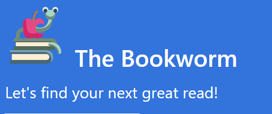
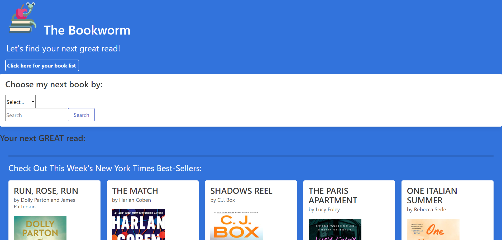

<!-- PROJECT LOGO -->
 

  

<h3 align="center">project_title</h3>

  

    project_description
     
    <a href="https://github.com/powe0186/project1"><strong>Explore the docs »</strong></a>
     
     
    <a href="https://github.com/powe0186/project1">View Demo</a>
    ·
    <a href="https://github.com/powe0186/project1/issues">Report Bug</a>
    ·
    <a href="https://github.com/powe0186/project1/issues">Request Feature</a>
  

<!-- TABLE OF CONTENTS -->

  
Table of Contents

  <ol>
    <li>
      <a href="#about-the-project">About The Project</a>
      <ul>
        <li><a href="#built-with">Built With</a></li>
      </ul>
    </li>
    <li><a href="#usage">Usage</a></li>
    <li><a href="#roadmap">Roadmap</a></li>
    <li><a href="#contributing">Contributing</a></li>
    <li><a href="#contact">Contact</a></li>
    <li><a href="#acknowledgments">Acknowledgments</a></li>
  </ol>

<!-- ABOUT THE PROJECT -->
## About The Project
  This web app allows you to search books by author or any keyphrase. It gives you a list of book suggestions based on you search. You may then save any searches to your reading list. You may also move books from your reading list to a list of books you have finished. 

  At initial load, the page gives you the current NY Times top 5 books.

(<a href="#top">back to top</a>)

### Built With
* [Google Books API] (https://developers.google.com/books)
* [NY Times Books API] (https://developer.nytimes.com/docs/books-product/1/overview)
* [moment.js](https://momentjs.com/)
* [bulma](https://bulma.io/)
* [JQuery](https://jquery.com)

(<a href="#top">back to top</a>)

<!-- CONTACT -->
## Contact

Alex Lane - email@email_client.com
Ben Powell - email@email_client.com
Karen Mitchell - email@email_client.com
Mike Kubesheski - email@email_client.com

Project Link: [https://github.com/powe0186/project1](https://github.com/powe0186/project1)   
Live Link: https://powe0186.github.io/project1/

(<a href="#top">back to top</a>)

